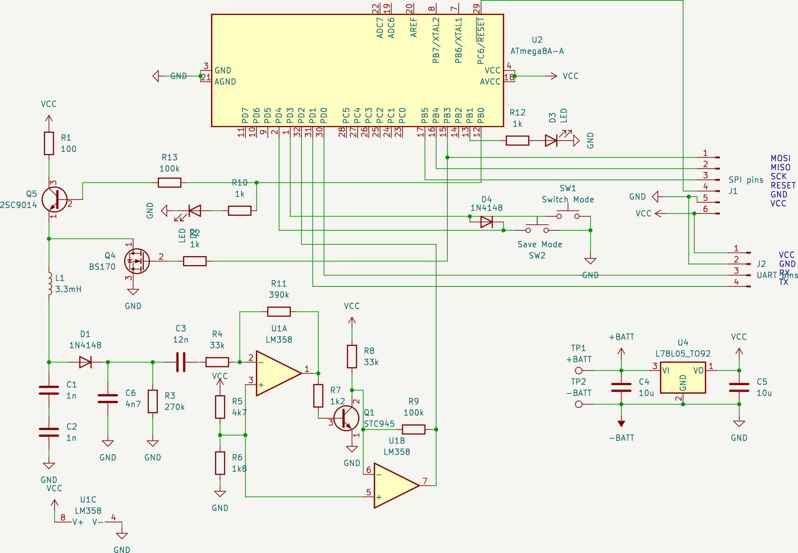

# RFID_125khz_reader_transmitter
Implementation of a 125 kHz RFID tag reader and transmitter. It utilizes the EM4100 protocol with Manchester encoding, using 64 cycles per bit.
The code is written in C for the Atmega8A and compiled using the avr-gcc compiler. 
The schematic is based on Vassilis Serasidis's project: <a href=https://www.serasidis.gr/circuits/RFID_reader/125kHz_RFID_reader.htm>125 kHz RFID Reader</a>  
The Manchester encoding algorithm is adopted from Atmel's application notes on Manchester encoding: <a href=https://ww1.microchip.com/downloads/en/AppNotes/Atmel-9164-Manchester-Coding-Basics_Application-Note.pdf>Atmel-9164 - Manchester Coding Basics.</a> 
## Hardware
I used a coil from an RFID tag with an inductance of approximately 3.3 mH, paired with a 490 pF capacitor to achieve a resonant frequency of 125 kHz.  
If you use a different coil or capacitor, be sure to create a resonant tank circuit. 
The transistors I used were any generic ones I could find on hand.
##

